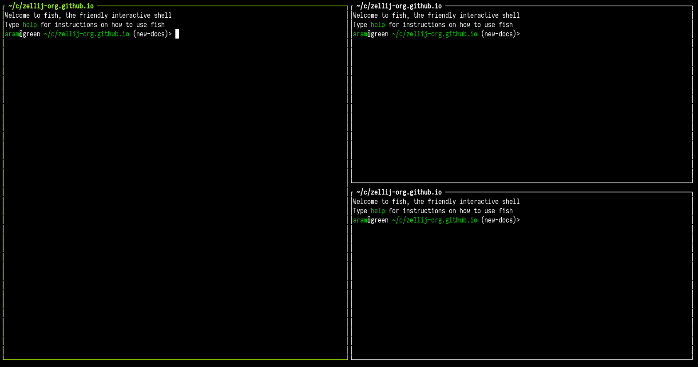
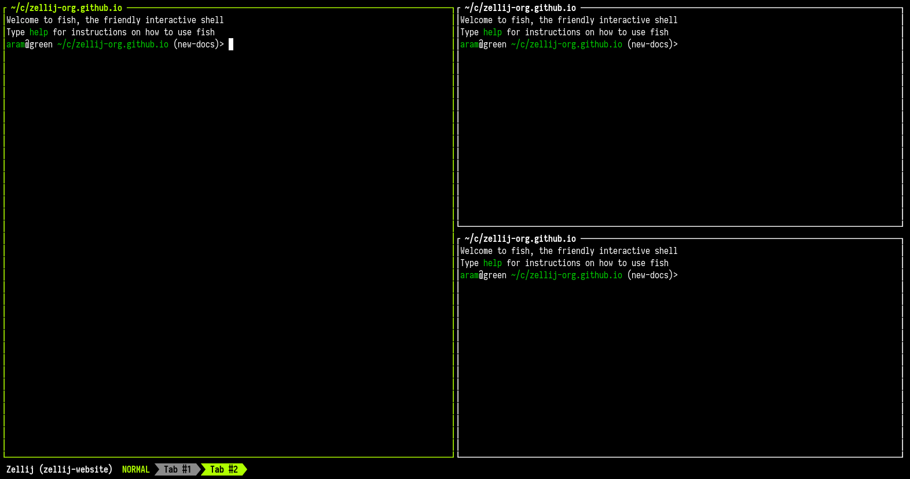
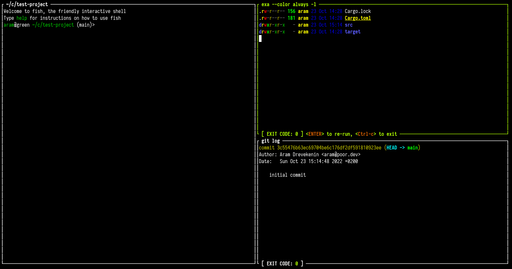
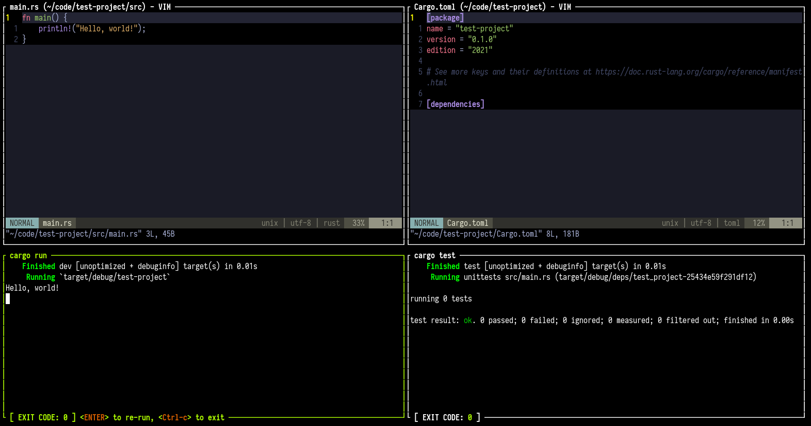
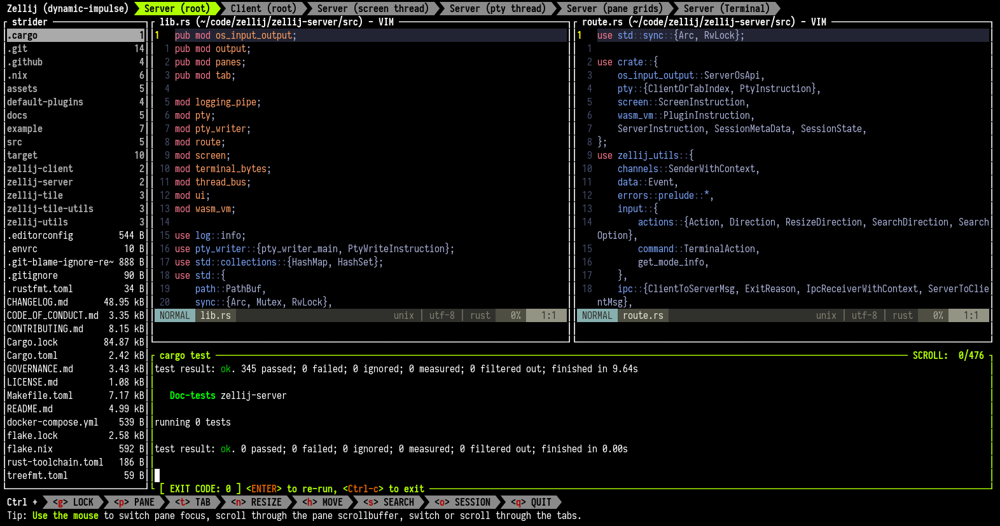

# Example layouts

## Classic three pane with vertical root

```kdl
layout {
    pane split_direction="vertical" {
        pane
        pane split_direction="horizontal" {
            pane
            pane
        }
    }
}
```

Will provide:



## Classic three panes with vertical root and compact status bar

```kdl
layout {
    pane split_direction="vertical" {
        pane
        pane split_direction="horizontal" {
            pane
            pane
        }
    }
    pane size=1 borderless=true {
        plugin location="zellij:compact-bar"
    }
}
```

Will provide:



## Quick generic project explorer

Cloned a new project, want to quickly explore it without much fuss?

```kdl
layout {
    pane split_direction="vertical" {
        pane
        pane split_direction="horizontal" {
            pane command="exa" {
                args "--color" "always" "-l"
            }
            pane command="git" {
                args "log"
            }
        }
    }
}
```

Will provide:




## Basic Rust project

Basic layout for a rust executable project

```kdl
layout {
    pane split_direction="vertical" size="60%" {
        pane edit="src/main.rs"
        pane edit="Cargo.toml"
    }
    pane split_direction="vertical" size="40%" {
        pane command="cargo" {
            args "run"
            focus true
        }
        pane command="cargo" {
            args "test"
        }
    }
}
```

When started in a project just created with `cargo init`, looks like this:



For convenience, here's a version that also loads Zellij's interface

```kdl
layout {
    pane size=1 borderless=true {
        plugin location="zellij:tab-bar"
    }
    pane split_direction="vertical" size="60%" {
        pane edit="src/main.rs"
        pane edit="Cargo.toml"
    }
    pane split_direction="vertical" size="40%" {
        pane command="cargo" {
            args "run"
            focus true
        }
        pane command="cargo" {
            args "test"
        }
    }
    pane size=2 borderless=true {
        plugin location="zellij:status-bar"
    }
}
```

## A more complex example (Zellij development)
Here's a layout used internally for Zellij development.

It can help on-board new developers by tying together related files and their tests, as well as useful plugins here and there.

```kdl
layout {
    default_tab_template {
        pane size=1 borderless=true {
            plugin location="zellij:tab-bar"
        }
        children
        pane size=2 borderless=true {
            plugin location="zellij:status-bar"
        }
    }
    pane_template name="tests_under_files" {
        pane split_direction="horizontal" {
            children
            pane command="cargo" size="30%" {
                args "test"
            }
        }
    }
    tab_template name="strider_tab" {
        pane size=1 borderless=true {
            plugin location="zellij:tab-bar"
        }
        pane split_direction="Vertical" {
            pane size="15%" {
                // TODO: when we support sending CWD to plugins, this should start in ./zellij-derver
                plugin location="zellij:strider"
            }
            children
        }
        pane size=2 borderless=true {
            plugin location="zellij:status-bar"
        }
    }
    strider_tab name="Server (root)" cwd="./zellij-server" focus=true {
        tests_under_files split_direction="vertical" {
            pane edit="./src/lib.rs"
            pane edit="./src/route.rs"
        }
    }
    tab name="Client (root)" cwd="./zellij-client" {
        tests_under_files split_direction="vertical" {
            pane edit="./src/lib.rs"
            pane edit="./src/input_handler.rs"
        }
    }
    tab name="Server (screen thread)" split_direction="vertical" cwd="./zellij-server/src" {
        pane edit="./screen.rs" name="SCREEN"
        pane edit="./tab/mod.rs" name="TAB"
        pane edit="./panes/terminal_pane.rs" name="TERMINAL PANE"
    }
    tab name="Server (pty thread)" split_direction="vertical" cwd="./zellij-server/src" {
        pane edit="./pty.rs" name="PTY"
        pane edit="./os_input_output.rs" name="OS_INPUT_OUTPUT"
    }
    tab name="Server (pane grids)" split_direction="horizontal" cwd="./zellij-server/src/panes" {
        pane split_direction="vertical" {
            pane edit="./tiled_panes/mod.rs" name="TILED PANES"
            pane edit="./tiled_panes/tiled_pane_grid.rs" name="TILED PANES - GRID"
            pane edit="./tiled_panes/pane_resizer.rs" name="TILED PANES - GRID - RESIZER"
        }
        pane split_direction="vertical" {
            pane edit="./floating_panes/mod.rs" name="FLOATING_PANES"
            pane edit="./floating_panes/floating_pane_grid.rs" name="FLOATING_PANES - GRID"
        }
    }
    tab name="Server (Terminal)" split_direction="horizontal" cwd="./zellij-server/src/panes" {
        pane split_direction="vertical" {
            pane edit="./terminal_pane.rs" name="TERMINAL PANE"
            pane edit="./grid.rs" name="GRID (ANSI PARSER)"
        }
        pane split_direction="vertical" {
            pane edit="./terminal_character.rs" name="TERMINAL CHARACTER"
            pane edit="./sixel.rs" name="SIXEL"
        }
    }
}
```

Here's how it looks like when opened:



## Your layout here?

Please make PRs with cool layouts (and screenshots!) to [our website repo](https://github.com/zellij-org/zellij-org.github.io) and we'd be happy to include your name and a link to your profile.
