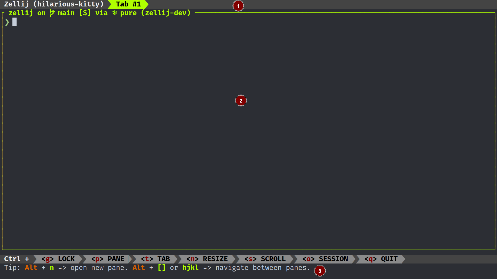
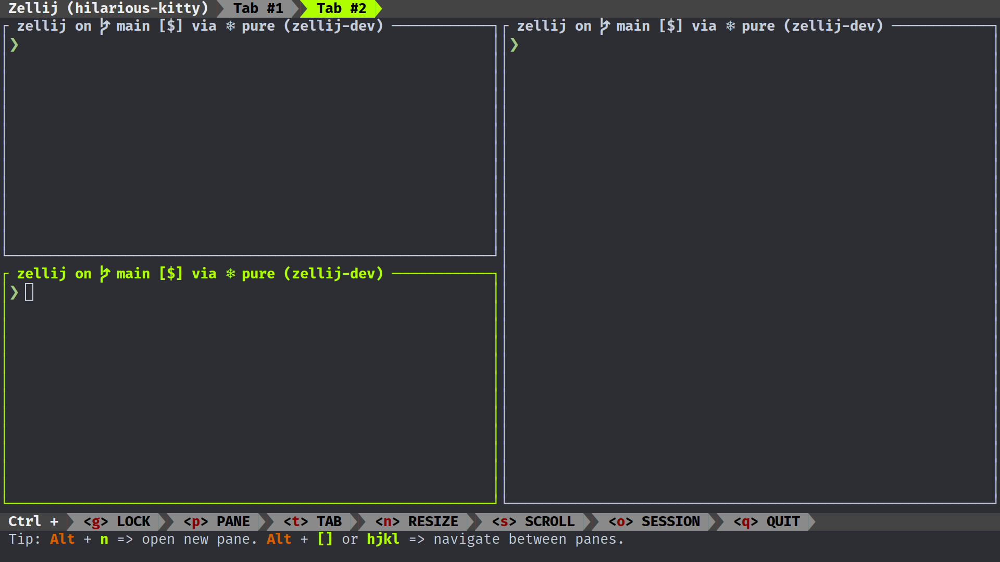

# Overview

Zellij is a workspace aimed at developers, ops-oriented people and
anyone who loves the terminal.
At its core, it is a terminal multiplexer (similar to tmux and screen),
but this is merely its infrastructure layer.

Zellij has a native layout and plugin system.
To understand Zellij a little bit better, let us take a look at
the default configuration.

## Default Configuration


The default configuration consists of:
1. The tab-bar plugin. It shows current tabs that are in use as well as the session name.
2. The pane, in which the default shell is started.
The title the shell sets can be seen in the upper left corner of the pane.
3. The status-bar plugin. It gives an overview over current default keybindings,
since Zellij is modal it can show hints based on modes it currently resides in.

To dive deeper in to how the default layout works and how to change it, checkout the [layouts](layouts.md) section.

Let's open a new tab and then a couple panes inside that new tab:
1. <kbd>Ctrl</kbd> + <kbd>t</kbd>
2. <kbd>n</kbd>
3. <kbd>Ctrl</kbd> + <kbd>p</kbd>
4. <kbd>n</kbd>
5. <kbd>Ctrl</kbd> + <kbd>p</kbd>
6. <kbd>←</kbd>
7. <kbd>d</kbd>

The status-bar should have guided us through:


And this is our current state:

Zellij doesn't need a terminal to keep commands running, because it uses a client
and server system. Let us disconnect and reconnect to the same session now:

1. <kbd>Ctrl</kbd> + <kbd>o</kbd>
2. <kbd>d</kbd>


If only one server session is running in the background zellij can restore the
connection automatically, if not then we need a specific session name.
We can get the name in the following way:
```
zellij list-sessions
```
And now we reattach to the currently running session:
```
zellij attach hilarious-kitty
```
