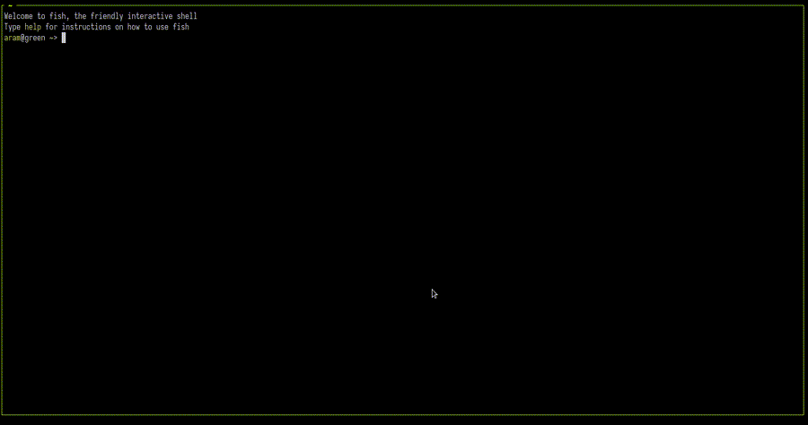
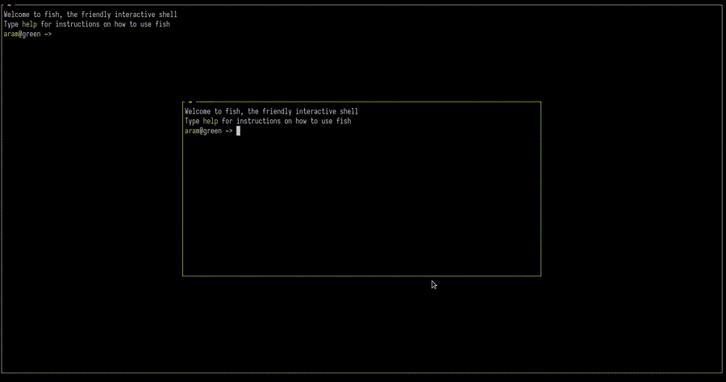

# Swap Layouts
Swap Layouts are an extension of [Layouts](./creating-a-layout.html) allowing users to open new panes in predefined locations as well as rearrange the currently open panes in a tab.

Swap layouts are separated between `swap_tiled_layout`s, which apply to the regular tiled panes, and `swap_floating_layout`s which apply to floating panes.

## Quickstart
You can dump the default swap layouts just as you can dump the base layouts:

```bash
$ zellij setup --dump-swap-layout default > /tmp/my-quickstart-swap-layout-file.swap.kdl
```

## How are Swap Layouts loaded?
Swap layouts can either be included directly in the layout file (inside the `layout` node, see below) or in a separate `.swap.kdl` file in the same folder (see below).

## Progression and Constraints

A basic swap layout can look like this:
```javascript
layout {
    swap_tiled_layout name="h2v" {
        tab max_panes=2 {
            pane
            pane
        }
        tab {
            pane split_direction="vertical" {
                pane
                pane
                pane
            }
        }
    }
}
```


When this layout is loaded, the first two panes are opened horizontally one above the other. The next pane opened (with `Alt` + `n`) will snap the layout into three vertical panes. If closed, the layout will snap back to two horizontal panes. Panes opened after the third will be laid out in an unspecified way.

An example with floating panes:
```javascript
layout {
    swap_floating_layout {
        floating_panes max_panes=1 {
            pane
        }
        floating_panes max_panes=2 {
            pane x=0
            pane x="50%"
        }
        floating_panes max_panes=3 {
            pane x=0 width="25%"
            pane x="25%" width="25%"
            pane x="50%"
        }
    }
}
```


### swap_tiled_layout
A `swap_tiled_layout` node should include one or more [`tab`](./creating-a-layout.html#tabs) nodes. These nodes can also be [`tab_template`](./creating-a-layout.html#tab-templates)s for the sake of brevity.
A `swap_tiled_layout` can have a `name`, which will be used in the Zellij UI to indicate which layout is selected.

### swap_floating_layout
A `swap_floating_layout` node should include one or more [`floating_panes`](./creating-a-layout.html#floating-panes) nodes. These can also be [`tab_templates`](./creating-a-layout.html#tab-templates) for the sake of brevity.
A `swap_floating_layout` can have a `name`, which will be used in the Zellij UI to indicate which layout is selected.

### Constraints
Each swap [`tab`](./creating-a-layout.html#tabs) or [`floating_panes`](./creating-a-layout.html#floating-panes) node may have one of three constraints: `max_panes`, `min_panes` or `exact_panes`:

eg.
```javascript
    // ...
    floating_panes exact_panes=2 {
        pane x=1 y=1
        pane x=10 y=10
    }
    // ...
    tab max_panes=2 {
        pane split_direction="vertical" {
            pane
            pane
        }
    }
    // ...
```

## Pane commands and plugins in Layouts
[`pane`](./creating-a-layout.html#panes) nodes in swap layouts may include [`command`](./creating-a-layout.html#command) nodes and [`plugin`](./creating-a-layout.html#plugin) nodes normally, but these will not be newly opened or closed by their absence. If panes like these are included in swap layouts, it is expected that they already appear on screen from the base layout. Otherwise the behaviour is unspecified and might change in later versions.

## Multiple swap layout nodes
Multiple `swap_tiled_layout` and `swap_floating_layout` nodes can be included in a single `layout`. In this case, the user can switch between them manually (by default with `Alt` + `[]`), or they will be switched to automatically if the current swap node does not meet the constraints when opening or closing a pane.

## Base
The basic layout loaded is called the `Base` layout, and can be switched back to as any other layout - it is considered to have an implicit `exact_panes` constraint of its total pane count.
This is true both to tiled panes and floating panes.

## Swap Layouts with extra panes
Swap layout nodes containing more panes than are on screen will place panes in a "breadth first" manner.

## Swap Layouts with too few panes
Swap layouts with fewer panes than are on screen will have all their panes applied first, and panes following them will be laid out in an unspecified manner.

## Swap Layout files (layout-name.swap.kdl)
Because swap layouts can get quite verbose, it's possible to include them in a separate file. The file should be in the same folder as the original layout and have a `swap.kdl` suffix instead of a `.kdl` suffix.

Eg.
```
my-layout.kdl
my-layout.swap.kdl
```

This file need not include the `layout` node, but should include the `swap_tiled_layout` and/or `swap_floating_layout` nodes directly.
